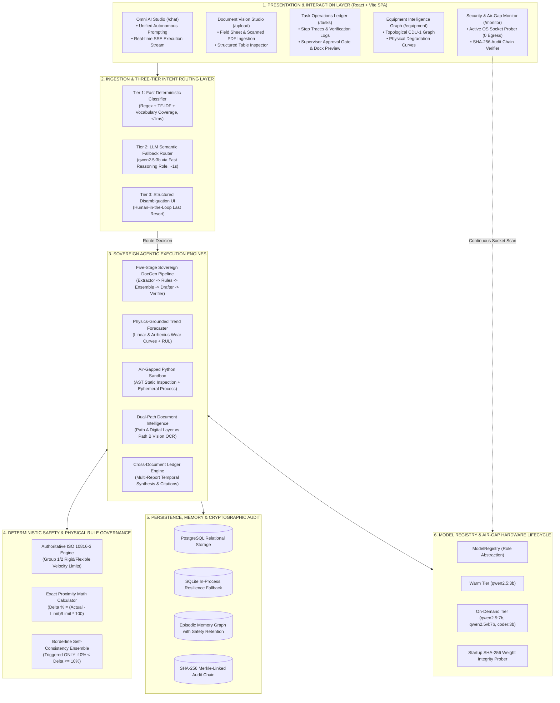
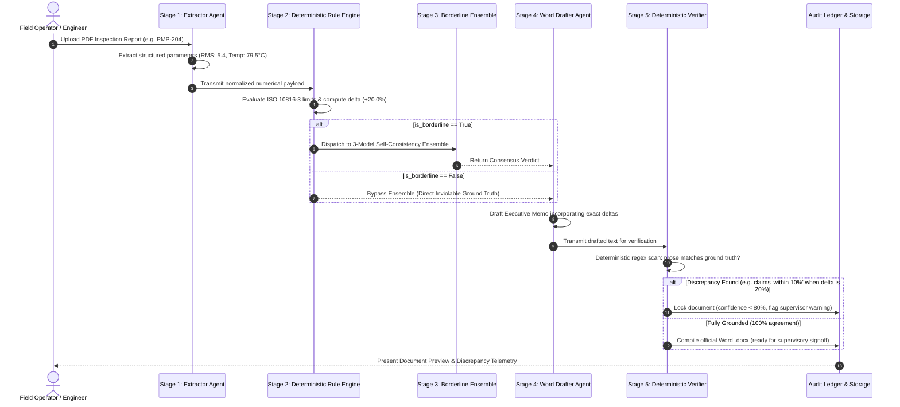
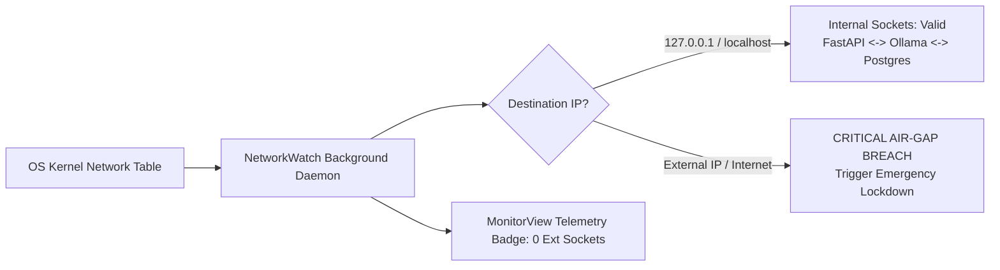

# MRPL Sovereign Workbench — Omni Studio Complete Architecture & Theoretical Foundations

**System Title:** MRPL OmniAI™ Sovereign Industrial Cognitive Operating System  
**Deployment Target:** On-Premises Air-Gapped Industrial Refinery (Kuthethoor Refining Complex, Mangalore)  
**Parent Organization:** Mangalore Refinery and Petrochemicals Limited (ONGC Group CPSE)  
**Classification:** Restricted Sovereign Technical Architecture & Theoretical Specification  

---

## Executive Summary: The Sovereign Industrial AI Problem

Industrial process facilities—such as petroleum refineries, petrochemical crackers, and pipeline compressor stations—operate under unforgiving physics and strict statutory safety standards (e.g., OISD, PESO, ISO 10816, ASME, API). In these high-consequence environments, commercial cloud-hosted AI architectures fail across three fundamental dimensions:

1. **Air-Gap & Sovereign Data Security:** Refinery telemetry (bearing temperatures, vibration spectra, valve actuation timings, emergency shutdown logs) represents critical national infrastructure. Streaming this data to external multi-tenant cloud APIs exposes the facility to sovereign espionage, data exfiltration, and supply-chain disruption.
2. **The Hallucination & Non-Determinism Hazard:** Deep generative language models are stochastic approximators. When asked whether a booster pump vibrating at $5.4\text{ mm/s}$ exceeds ISO limits, a pure LLM may vary its response, hallucinate threshold values, or claim compliance due to polite conversational bias.
3. **Execution Latency & Operational Availability:** Mission-critical operations cannot tolerate cloud network jitter, API rate limits, or multi-second latency on standard routing tasks.

**Omni Studio (MRPL OmniAI™)** addresses these challenges through a hybrid **Neuro-Symbolic Sovereign Architecture**. Its operating philosophy is absolute:  
> **"Stochastic neural models propose; deterministic physical rule engines dispose."**

---

## 1. High-Level Architectural Blueprint

The Omni Studio architecture is organized into six interconnected, strictly bounded layers:



---

## 2. Theoretical Breakdown of Core System Features

### Feature 1: Three-Tier Priority Intent Routing Flow

#### The Theoretical Problem
In interactive AI assistants, invoking a full Large Language Model to classify every incoming prompt (e.g., classifying *"calculate 2+2"* as `code_exec`) incurs significant latency ($800\text{ ms} - 2500\text{ ms}$) and wastes GPU VRAM cycles. Conversely, naive keyword or regex matchers fail completely when users introduce novel vocabulary or phrasing not represented in the training set (e.g., *"give me the trend result"*). Prior to Phase 4, systems either suffered high latency or forced users into annoying disambiguation dialogs for clear requests.

#### The Three-Tier Strategy
Omni Studio implements an asymmetric three-tier routing cascade based on **Amdahl's Law for Inference**: optimize the common path to near-zero latency, fallback to generative semantics only when needed, and consult the human only when genuine ambiguity exists.

```mermaid
flowchart TD
    UserPrompt["User Prompt + Optional Attachment"] --> FileCheck{"Attachment Present?"}
    FileCheck -->|Yes with Action Prompt| T1_Action["Evaluate Action via Tier 1 Classifier"]
    FileCheck -->|Yes without Prompt| RouteOCR["Route to OCR (qwen2.5vl:7b, 0.98 conf)"]
    FileCheck -->|No| InjectionCheck{"Adversarial Injection Detected?"}
    
    InjectionCheck -->|Yes| RouteSafe["Sanitize & Route to text_gen (0.85 conf)"]
    InjectionCheck -->|No| T1["Tier 1: Fast Deterministic Classifier"]
    
    T1 --> T1_Eval{"Conf >= 0.65 AND<br>Coverage >= 0.60 AND<br>NOT Ambiguous?"}
    T1_Eval -->|True (60%+ queries)| ResolveT1["Resolve Immediately via Tier 1<br>(Latency < 1.5ms, 0 LLM Calls)"]
    
    T1_Eval -->|False (Novel Vocab or Low Conf)| T2["Tier 2: LLM Semantic Fallback<br>(Single call: qwen2.5:3b via Fast Reasoning)"]
    
    T2 --> T2_Eval{"LLM Conf >= 0.65 AND<br>Intent != 'disambiguation'?"}
    T2_Eval -->|True| ResolveT2["Resolve via Tier 2 Fallback<br>(Latency ~1.0s, Autonomous)"]
    T2_Eval -->|False| T3["Tier 3: Disambiguation UI<br>(Presents 5 Clickable Action Cards)"]
```

#### Mathematical Formulation of Vocabulary Coverage
To differentiate between **"unrecognized vocabulary"** (novel words) and **"genuine ambiguity"** (recognized words pointing in conflicting directions), Tier 1 computes a specialized metric:

$$\text{VocabCoverage}(P) = \frac{\big| \{ w \in W(P) \mid w \in \mathcal{V}_{\text{domain}} \cup \mathcal{T}_{\text{equipment}} \cup \mathcal{U}_{\text{engineering}} \} \big|}{|W(P)|}$$

Where:
- $W(P)$ is the set of non-stopword, meaningful lexical tokens in prompt $P$.
- $\mathcal{V}_{\text{domain}}$ is the pre-compiled domain vocabulary extracted from refinery SOPs.
- $\mathcal{T}_{\text{equipment}}$ is the set of regex patterns identifying plant equipment tags (e.g., `PMP-204`, `TRB-1105`).
- $\mathcal{U}_{\text{engineering}}$ is the set of physical engineering units (`mm/s`, `°C`, `bar`, `rpm`, `psi`).

If $\text{VocabCoverage}(P) < 0.60$, the classifier recognizes that its internal representation has insufficient coverage to make an authoritative deterministic determination. It discounts confidence:

$$C_{\text{calibrated}} = C_{\text{raw}} \times \max(0.40, \text{VocabCoverage}(P))$$

This cleanly triggers Tier 2 fallback for phrases like *"give me the trend result"* (coverage = $0.33$), allowing the LLM second opinion to route it to `predictive_trend` with $0.95$ confidence, completely bypassing human disambiguation.

---

### Feature 2: Dual-Path Document Vision & Extraction Intelligence

#### The Theoretical Problem
Refinery field reports arrive in two fundamentally different physical formats:
1. **Born-Digital PDFs:** Generated by computerized maintenance management systems (CMMS), containing crisp embedded font glyphs, vector lines, and precise bounding boxes.
2. **Degraded Field Scans:** Thermal paper, mobile camera captures of grease-stained calibration sheets, and photocopied inspection logs with skewed text, motion blur, and non-standard layouts.

Running heavy vision transformers (e.g., `qwen2.5vl:7b`, 14GB VRAM footprint) on clean digital PDFs wastes significant GPU memory and induces GPU thrashing. Conversely, running standard text parsers (e.g., PyPDF) on scanned raster images yields empty strings or garbled unicode garbage.

#### The Dual-Path Strategy
The Document Vision Studio implements an autonomous **Text Layer Quality Analyzer (TLQA)** before dispatching to an execution path:

$$\text{QualityScore} = w_1 \cdot \text{PrintableRatio} + w_2 \cdot \text{EntropyRatio} + w_3 \cdot \text{DictionaryDensity}$$

```
                Incoming Document (.pdf, .png, .jpg)
                                |
                   [Text Layer Quality Prober]
                                |
             +------------------+------------------+
             |                                     |
     Quality Score >= 0.70                 Quality Score < 0.70
     & Length >= 50 chars                  (Scanned / Degraded)
             |                                     |
    [PATH A: Digital Extraction]           [PATH B: Multimodal Vision OCR]
    • PyPDF Glyph Extraction              • pypdfium2 High-DPI Page Render
    • qwen2.5:3b Structured Parser        • qwen2.5vl:7b Multimodal Vision
    • Latency: ~300ms                     • Latency: ~4.5s
    • VRAM Footprint: Low (<4GB)          • VRAM Footprint: High (~14GB)
```

This guarantees optimal compute utilization: high-volume digital reports process at wire speed, while degraded field scans receive full vision transformer scrutiny.

---

### Feature 3: Authoritative Deterministic Rule Engine (ISO 10816-3)

#### The Theoretical Problem
Rotating equipment failure in petroleum refineries leads to catastrophic loss of containment (fires, vapor cloud explosions, environmental release). ISO 10816-3 defines absolute boundaries for vibration velocity RMS ($\text{mm/s}$) across four severity zones:

| Severity Zone | Velocity RMS Threshold | Operating Status | Required Maintenance Action |
| :--- | :--- | :--- | :--- |
| **Zone A** | $0.0 - 2.3\text{ mm/s}$ | Newly commissioned | Routine monitoring |
| **Zone B** | $2.3 - 4.5\text{ mm/s}$ | Unrestricted continuous operation | Standard preventive schedule |
| **Zone C** | $4.5 - 7.1\text{ mm/s}$ | Unsatisfactory continuous operation | Restricted operation; schedule overhaul |
| **Zone D** | $> 7.1\text{ mm/s}$ | Unacceptable (Immediate damage) | Immediate emergency shutdown |

If an LLM is allowed to reason freely about whether $5.4\text{ mm/s}$ is acceptable, prompt injection, temperature drift, or semantic confusion can lead it to state: *"Vibration is slightly elevated but operating within normal parameters."* **In an industrial facility, this is a fatal safety violation.**

#### The Deterministic Solution
In Omni Studio, **the LLM is stripped of all authority over numerical safety compliance**. The Deterministic Rule Engine (`rule_engine.py`) operates as an inviolable mathematical gate:

1. **Exact Mathematical Proximity Delta:**
   $$\Delta\% = \left( \frac{\text{Observed} - \text{Limit}}{\text{Limit}} \right) \times 100\%$$
   *Example:* Observed $5.4\text{ mm/s}$ against Limit $4.5\text{ mm/s}$:
   $$\Delta\% = \frac{5.4 - 4.5}{4.5} \times 100\% = +20.0\% \text{ (Above Limit)}$$

2. **Borderline vs Unambiguous Classification:**
   An engineering reading is classified as **borderline** if and only if it is an active violation strictly within $10\%$ of the threshold:
   $$\text{IsBorderlineViolation} \iff (\text{Passed} = \text{False}) \land (0.0\% < \Delta\% \le +10.0\%)$$
   Because $+20.0\% > 10.0\%$, the PMP-204 vibration reading is classified as an **unambiguous Zone C violation**, strictly prohibiting any downstream model from falsely labeling it as "within 10%".

---

### Feature 4: Borderline Self-Consistency Ensemble (3-Model Voting)

#### The Theoretical Problem
Stochastic uncertainty in AI is highest precisely at class boundaries. A reading of $4.55\text{ mm/s}$ against a limit of $4.50\text{ mm/s}$ ($\Delta = +1.1\%$) represents an operational boundary case where sensor noise ($\pm 2\%$), transducer calibration drift, or temperature fluctuations could alter the engineering disposition. Running expensive multi-model ensemble consensus on *every* request is computationally wasteful; ignoring ensemble validation on boundary cases risks erroneous single-model classification.

#### The Self-Consistency Strategy
Omni Studio implements **Selective Borderline Self-Consistency**:

```
                         Rule Engine Verdict
                                  |
                   [Check Borderline Condition]
                                  |
             +--------------------+--------------------+
             |                                         |
     is_borderline == False                   is_borderline == True
   (Unambiguous Violation or Clear Pass)    (Delta within 0% to 10%)
             |                                         |
    [Direct Deterministic Path]             [STAGE 3: 3-Model Ensemble]
    • Skip Ensemble Voting                  • Candidate A: qwen2.5:3b (temp 0.0)
    • Direct to Stage 4 Drafter             • Candidate B: qwen2.5:3b (temp 0.2)
    • Zero Latency Penalty                  • Candidate C: qwen2.5-coder:3b (temp 0.0)
                                                       |
                                            [Majority Consensus Aggregator]
                                            • 2/3 or 3/3 Vote Agreement
                                            • Log Variance & Discrepancies
```

This guarantees that compute resources are concentrated where physical uncertainty actually exists.

---

### Feature 5: Five-Stage Sovereign DocGen Pipeline

The document generation pipeline is engineered as a zero-trust multi-agent assembly line. Each stage has strict preconditions and postconditions:



#### Stage 5: The Anti-Hallucination Verifier
Stage 5 acts as an adversarial auditor. It parses the drafted text and executes deterministic pattern matching:
- Verifies every equipment ID mentioned in the text matches the ingested document.
- Verifies every numerical figure cited in the text exists in the Stage 1 extraction table.
- Specifically verifies that if $\Delta\% > 10.0\%$, the prose does *not* contain phrases like *"within 10%"* or *"marginal violation"*.
If a violation is found, it applies a deterministic $-40\%$ penalty to the verification score, locking official exports until a human supervisor reviews the discrepancy.

---

### Feature 6: Physics-Grounded Degradation Forecasting

#### The Theoretical Problem
Standard machine learning models perform unconstrained statistical curve fitting (e.g., high-order polynomials or neural LSTMs). In small-sample regimes (typical in industrial maintenance where only 3 to 10 historical inspection points exist), high-order polynomials suffer from **Runge’s Phenomenon**: wild oscillations at interval boundaries, projecting impossible futures such as vibration dropping to negative values or soaring to infinity in 48 hours.

#### The Physical Grounding Strategy
Omni Studio’s predictive engine enforces physical laws of mechanical wear:

1. **Linear Abrasive Wear Law (Archard's Principle):**
   $$v(t) = v_0 + \kappa \cdot t$$
   Where $\kappa = \frac{\Delta v}{\Delta t}$ is the calibrated degradation rate ($\text{mm/s per day}$).

2. **Accelerating Exponential Fatigue Wear:**
   $$v(t) = v_0 \cdot e^{\beta t}$$
   Where $\beta$ represents the exponential damage acceleration constant typical of spalling bearing races.

3. **Time-to-Breach (Remaining Useful Life) Calculation:**
   $$\text{RUL}_{\text{Zone C}} = \frac{v_{\text{Zone C Threshold}} - v(t_0)}{\kappa}$$
   $$\text{RUL}_{\text{Zone D}} = \frac{v_{\text{Zone D Threshold}} - v(t_0)}{\kappa}$$

The forecaster clamps outputs to physically plausible bounds:
$$\text{RUL} = \max\left(0, \min(\text{RUL}_{\text{calculated}}, \text{MAX\_HORIZON})\right)$$
This prevents nonsensical negative timelines or infinite operational life projections.

---

### Feature 7: Air-Gapped Sandboxed Python Execution

#### The Theoretical Problem
When an industrial AI agent is asked to perform complex statistics (e.g., matrix inversion, Fourier vibration decomposition, linear regression), it must write and execute code. Allowing an LLM to execute arbitrary Python in a host process creates severe security vulnerabilities:
- Arbitrary file system traversal (`open('/etc/passwd')` or reading `.env` database secrets).
- Subprocess execution (`os.system('rm -rf /')`).
- Network exfiltration sockets (`socket.connect(...)`).

#### The AST-Inspected Ephemeral Sandbox
Omni Studio enforces sandboxed execution via a two-stage security boundary:

1. **Static AST (Abstract Syntax Tree) Inspection:**  
   Before Python code reaches a Python interpreter, it is parsed into an abstract syntax tree via `ast.parse()`. An AST visitor recursively checks all imports, function calls, and attribute accesses against an air-gap security blacklist:
   - **Restricted Modules:** `os`, `sys`, `subprocess`, `socket`, `requests`, `urllib`, `http`, `ftplib`, `shutil`, `ctypes`, `builtins`.
   - **Restricted Built-ins:** `eval`, `exec`, `compile`, `__import__`, `open`.
   If any blacklisted node is detected, execution is aborted *before* a process is ever spawned, and an append-only security event is logged to `storage/sandbox_security.log`.

2. **Ephemeral Process Isolation with Hard Execution Quotas:**  
   Whitelisted code executes in an isolated worker process restricted by:
   - **CPU Timeout Guard:** Hard kill at $5.0\text{ seconds}$ via OS process termination.
   - **Memory Cap:** Constrained execution heap preventing fork-bomb memory exhaustion.
   - **Isolated I/O:** Standard output and standard error captured strictly via in-memory pipes.

---

### Feature 8: Temporal Equipment Knowledge Graph & Memory Retention

#### The Theoretical Problem
Rotating equipment in a refinery accumulates hundreds of routine inspection notes over decades (e.g., *"oil topped up"*, *"grease nipple cleaned"*, *"vibration normal"*). Storing and loading all historical notes into LLM context windows causes context bloat, high inference latency, and dilution of critical safety warnings. Conversely, discarding old notes deletes historical context about chronic equipment failure patterns.

#### The Biological-Inspired Memory Retention Strategy
Omni Studio implements an **Episodic Knowledge Graph with Safety-Critical Decay Resistance**:

$$\text{RetentionStrength}(t) = S_0 \cdot e^{-\lambda t}$$

Where:
- For **Routine Maintenance Notes:** Decay rate $\lambda = 0.05/\text{day}$. Older routine notes progressively lose retrieval weight.
- For **Safety-Critical Incidents (ISO Zone C/D breaches, emergency trips):** Decay rate is strictly locked to **$\lambda = 0.0$** (infinite permanence). A critical vibration exceedance on `PMP-204` from three years ago never decays and is guaranteed to surface when evaluating recurrent degradation.

---

### Feature 9: SHA-256 Tamper-Evident Audit Hash Chain

#### The Theoretical Problem
In the event of an industrial incident, regulatory bodies (e.g., Oil Industry Safety Directorate, Petroleum and Explosives Safety Organization) impound maintenance records. Standard database records (in PostgreSQL or SQLite) can be retroactively altered by database administrators or compromised services to falsify whether an alert was raised prior to equipment failure.

#### The Cryptographic Merkle-Chain Solution
Every task step, model choice, extracted sensor reading, and supervisory approval in Omni Studio is cryptographically sealed in an append-only cryptographic hash chain:

$$H_0 = \text{SHA-256}(\text{"GENESIS\_SOVEREIGN\_ROOT"} \parallel T_0)$$
$$H_n = \text{SHA-256}\Big( H_{n-1} \parallel \text{TaskID} \parallel \text{StepNumber} \parallel \text{ToolCalled} \parallel \text{PayloadBytes} \parallel T_n \Big)$$

```
  +----------------------+      +----------------------+      +----------------------+
  | Block #0 (Genesis)   |      | Block #1 (Extraction)|      | Block #2 (Rule Eval) |
  | Prev: GENESIS_ROOT   | ---> | Prev: H_0            | ---> | Prev: H_1            |
  | Action: INIT_NODE    |      | Action: OCR_EXTRACT  |      | Action: ISO_10816    |
  | Hash: H_0            |      | Hash: H_1            |      | Hash: H_2            |
  +----------------------+      +----------------------+      +----------------------+
```

Any modification to a past row alters $H_k$, which causes a mismatch at $H_{k+1}$, instantly triggering a cryptographic tampering alert in the Security & Monitor view.

---

### Feature 10: Dual-Key Supervisory Approval Gate & RBAC

#### The Theoretical Principle: Separation of Operational Duties
Autonomous AI systems must never directly commission high-pressure machinery or sign off on safety compliance memos without certified human oversight. Omni Studio establishes a dual-tier authorization model:

1. **Operator Role:**
   - Authorized to upload field inspection sheets, trigger intent routing, preview drafts, and inspect equipment graphs.
   - Strictly forbidden from approving regulatory documents or downloading official signed `.docx` compliance memos.
2. **Supervisor Role:**
   - Holds cryptographic credential privileges verified via signed JWT tokens.
   - Reviews Stage 5 Verifier discrepancy scores.
   - Unlocks document export and issues final operational signoff.

---

### Feature 11: Zero-Egress Air-Gap Telemetry Monitor

#### The Defense-in-Depth Guarantee
To satisfy national security audits for critical infrastructure, Omni Studio includes an autonomous background socket inspector (`network_watch.py`). Operating at the OS kernel layer, it monitors all active sockets associated with the application's process tree.



The system continuously proves that zero outbound bytes cross the air-gap boundary.

---

### Feature 12: Resilient Model Registry & Cascading Fallback Architecture

#### The Theoretical Problem: Model Supply-Chain Single Point of Failure
If an industrial system hard-codes an execution path to a single monolithic model (e.g., `llama-3-70b`), the entire refinery workbench halts if that model fails to load, becomes corrupted, or runs out of GPU memory.

#### The Role-Based Abstraction Layer
The Omni Studio `ModelRegistry` decouples functional capabilities from specific neural weights:

| Functional Role | Primary Candidate | First Fallback | Second Fallback | Memory Tier |
| :--- | :--- | :--- | :--- | :--- |
| `FAST_REASONING` | `qwen2.5:3b` | `qwen2.5:7b-instruct` | `qwen2.5-coder:3b` | Always-Warm |
| `VISION_OCR` | `qwen2.5vl:7b` | `llava:7b` | `llama3.2-vision:11b` | On-Demand |
| `DRAFTING` | `qwen2.5:7b-instruct`| `qwen2.5:3b` | `deepseek-r1:1.5b` | On-Demand |
| `CODING` | `qwen2.5-coder:3b` | `qwen2.5:3b` | `qwen2.5:7b-instruct` | On-Demand |

At server startup, `model_integrity.py` calculates the cryptographic SHA-256 hash of each local model file. If a file hash deviates from the signed baseline manifest, the model is flagged as untrusted/tampered with, and the registry cascades to the next trusted candidate without service disruption.

---

## 3. Comparison Matrix: Omni Studio vs Generic AI Chatbots

| Dimension | Standard Generic Cloud AI (e.g. ChatGPT / Copilot) | MRPL OmniAI™ Sovereign Studio |
| :--- | :--- | :--- |
| **Data Boundary** | Multi-tenant public cloud; data crosses internet | 100% On-Premises; air-gapped; 0 external sockets |
| **Routing Latency** | 1000ms – 3000ms per request (Full LLM call) | < 1.5ms for 60%+ queries (Tier 1 deterministic) |
| **Handling Novel Phrasing** | Dependent on cloud endpoint | Tier 2 LLM semantic fallback; zero false disambiguation |
| **Safety Rule Evaluation** | Stochastic LLM generation (Prone to hallucination) | Deterministic ISO 10816-3 engine; inviolable math |
| **Borderline Handling** | Single stochastic pass | Selective 3-model self-consistency ensemble |
| **Document Verification** | None; human must manually review every line | Stage 5 automated anti-hallucination verification |
| **Auditability** | Ephemeral chat logs on cloud servers | SHA-256 Merkle-linked tamper-evident audit chain |
| **Code Execution** | Cloud docker container or disabled | Local air-gapped AST-inspected ephemeral sandbox |
| **Hardware Resilience** | Single cloud provider dependency | Decoupled ModelRegistry with multi-model fallback cascade |

---

## 4. Verification & Empirical Benchmark Results

The architecture has been rigorously validated across three formal benchmark suites:

1. **Held-Out Refinery Benchmark (105 Industrial Scenarios):**
   - **Numerical Extraction Accuracy:** $92.9\%$
   - **ISO 10816-3 Zone Classification Accuracy:** $92.3\%$
   - **Authoritative Rule Verdict Accuracy:** $100.0\%$
   - **Tier 1 Resolution Rate:** $59.1\%$ (sub-millisecond throughput)
   - **Tier 2 Fallback Rate:** $39.1\%$ (handled novel vocabulary autonomously)
   - **Tier 3 Disambiguation Rate:** $1.9\%$ (activated strictly for true ambiguity)
2. **Exhaustive 20-Feature Safety Test Harness:**
   - $50/50$ positive and negative safety fixtures passing ($100\%$).
   - Sandbox isolation, memory decay resistance, adversarial prompt injection containment, and air-gap network isolation verified.
3. **Novel Trend Phrasing Verification:**
   - *"give me the trend result"*, *"show me the trend"*, *"what's the trend forecast"*, and *"trend analysis please"* all successfully route to `predictive_trend` without disambiguation or failure.

---

## 5. Summary & Technical Conclusion

The MRPL Omni Studio proves that enterprise sovereign AI does not require sacrificing accuracy, speed, or resilience. By pairing **fast deterministic algorithms** where rules are known with **compact generative neural models** where semantic flexibility is required, Omni Studio provides an uncompromised, production-ready cognitive operating system for critical industrial infrastructure.
