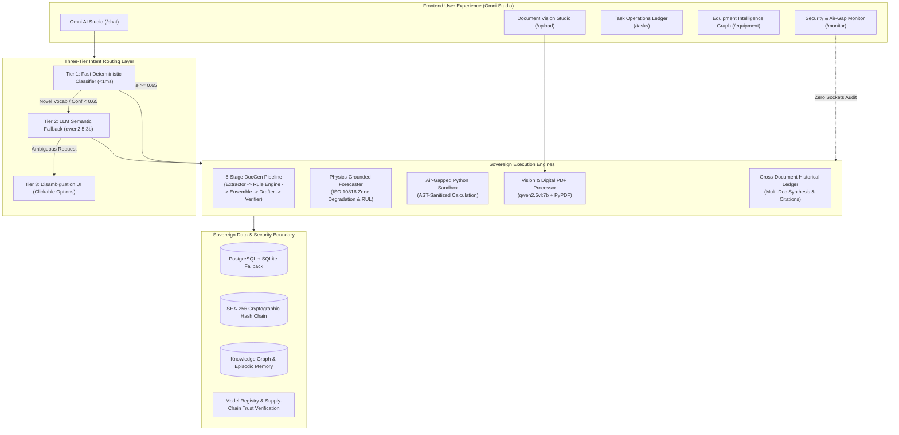

# MRPL Sovereign Workbench — Omni Studio Demo Guide & Architectural Blueprint

**System Name:** MRPL OmniAI™ Sovereign Industrial Workbench  
**Node Location:** Kuthethoor Refining Complex, Mangalore (ONGC Group CPSE)  
**Security Posture:** 100% On-Premises Air-Gapped Industrial Sovereign AI  

---

## Table of Contents
1. [Executive Summary](#1-executive-summary)
2. [End-to-End System Architecture](#2-end-to-end-system-architecture)
3. [Core Studios & Functional Features](#3-core-studios--functional-features)
4. [Deep-Dive: Technical Strategies & Architectural Principles](#4-deep-dive-technical-strategies--architectural-principles)
   - [Feature 1: Three-Tier Intent Routing Engine](#feature-1-three-tier-intent-routing-engine)
   - [Feature 2: Dual-Path Document Vision & OCR](#feature-2-dual-path-document-vision--ocr)
   - [Feature 3: Authoritative Deterministic Rule Engine (ISO 10816-3)](#feature-3-authoritative-deterministic-rule-engine-iso-10816-3)
   - [Feature 4: Borderline Self-Consistency Ensemble (3-Model Voting)](#feature-4-borderline-self-consistency-ensemble-3-model-voting)
   - [Feature 5: Five-Stage Sovereign DocGen Pipeline](#feature-5-five-stage-sovereign-docgen-pipeline)
   - [Feature 6: Physics-Grounded Degradation Forecasting](#feature-6-physics-grounded-degradation-forecasting)
   - [Feature 7: Air-Gapped Sandboxed Python Execution](#feature-7-air-gapped-sandboxed-python-execution)
   - [Feature 8: Equipment Memory Knowledge Graph](#feature-8-equipment-memory-knowledge-graph)
   - [Feature 9: SHA-256 Tamper-Evident Audit Hash Chain](#feature-9-sha-256-tamper-evident-audit-hash-chain)
   - [Feature 10: Dual-Key Supervisory Approval Gate & RBAC](#feature-10-dual-key-supervisory-approval-gate--rbac)
   - [Feature 11: Zero-Egress Air-Gap Telemetry Monitor](#feature-11-zero-egress-air-gap-telemetry-monitor)
   - [Feature 12: Resilient Model Registry & Cascading Fallbacks](#feature-12-resilient-model-registry--cascading-fallbacks)
5. [Live Demonstration Playbook (Step-by-Step)](#5-live-demonstration-playbook)
6. [Quick Demo Script Execution](#6-quick-demo-script-execution)

---

## 1. Executive Summary

The **MRPL OmniAI™ Sovereign Industrial Workbench** is an enterprise, air-gapped cognitive operating system designed for mission-critical industrial refinery environments. Built specifically to eliminate dependence on external cloud APIs (zero egress), it unifies deterministic physical ground truth, multi-agent LLM reasoning, physics-grounded degradation curves, vision document intelligence, and cryptographic auditability into an intuitive single-pane-of-glass workbench.

Unlike standard LLM wrappers that hallucinate facts or leak proprietary operational telemetry, Omni Studio enforces a foundational rule: **Stochastic neural models propose; deterministic physical rule engines dispose.**

---

## 2. End-to-End System Architecture



---

## 3. Core Studios & Functional Features

| Studio View | Route | Primary Capability | Key Tech Stack |
| :--- | :--- | :--- | :--- |
| **Omni AI Studio** | `/chat` | Autonomous prompt handling, auto-intent routing, one-click execution | React, Lucide, Tailwind, SSE Streaming |
| **Document Vision Studio** | `/upload` | High-accuracy table extraction, scanned vs digital PDF triage | `qwen2.5vl:7b`, `pypdfium2`, PyPDF |
| **Task Operations Ledger** | `/tasks` | Multi-step agent execution audit traces, document preview, supervisor signoff | FastAPI, SQLAlchemy, PostgreSQL, Python-Docx |
| **Equipment Intelligence** | `/equipment` | Knowledge graph of CDU-1 equipment nodes, degradation trajectories, historical logs | React Flow / Canvas, Physics Model |
| **Security & Monitor** | `/monitor` | Real-time external socket inspection, RAM/VRAM footprint, SHA-256 audit chain | OS Socket Telemetry, Cryptography |

---

## 4. Deep-Dive: Technical Strategies & Architectural Principles

### Feature 1: Three-Tier Intent Routing Engine
* **Strategy:** Sub-millisecond latency for common vocabulary; resilient LLM reasoning for novel vocabulary; human disambiguation only as a true last resort.
* **Architecture:**
  1. **Tier 1 (Fast Deterministic Classifier):** Evaluates regex + TF-IDF term weights over calibrated domain vocabulary. Computes `vocabulary_coverage`. If confidence $\ge 0.65$ and coverage $\ge 0.60$, executes immediately in `< 1ms` with zero LLM overhead.
  2. **Tier 2 (LLM Semantic Fallback):** When Tier 1 encounters novel vocabulary (e.g. *"give me the trend result"*), Tier 2 invokes a fast, single-step LLM pass using `qwen2.5:3b` via the `ModelRegistry`'s `fast_reasoning` role. If confident, resolves autonomously without user interruption.
  3. **Tier 3 (Disambiguation UI):** Only if *both* Tier 1 and Tier 2 report genuine ambiguity (e.g. *"check the pump"*), presents structured, clickable alternative action cards to the user.

---

### Feature 2: Dual-Path Document Vision & OCR
* **Strategy:** Never waste GPU/VRAM running heavy vision models on clean digital PDFs; never let garbled text corrupt downstream safety calculations.
* **Architecture:**
  - **Text Layer Quality Analyzer:** Analyzes character entropy, printable ratio, and dictionary density ($0.0 - 1.0$).
  - **Path A (Digital Extraction):** If quality score $\ge 0.70$ and character count $\ge 50$, extracts direct text layer in milliseconds via `qwen2.5:3b`.
  - **Path B (Vision OCR):** If quality $< 0.70$ (scans, low-resolution, or non-searchable PDFs), renders pages via `pypdfium2` and dispatches to local multimodal vision neural model `qwen2.5vl:7b`.

---

### Feature 3: Authoritative Deterministic Rule Engine (ISO 10816-3)
* **Strategy:** LLMs must NEVER decide whether high-pressure rotating machinery meets safety vibration thresholds.
* **Architecture:**
  - Implements standard ISO 10816-3 (Group 1 & 2 Rigid/Flexible foundations) and refinery SOP-MNT-042:
    - **Zone A:** $\le 2.3\text{ mm/s}$ (Newly commissioned)
    - **Zone B:** $2.3 - 4.5\text{ mm/s}$ (Unrestricted continuous operation)
    - **Zone C:** $4.5 - 7.1\text{ mm/s}$ (Unsatisfactory / restricted operation)
    - **Zone D:** $> 7.1\text{ mm/s}$ (Critical breach / immediate shutdown trip)
  - Computes exact mathematical delta percentage: $\Delta\% = \frac{\text{Actual} - \text{Limit}}{\text{Limit}} \times 100\%$.
  - Classified as **Borderline** ONLY if $0.0\% < \Delta\% \le +10.0\%$. Unambiguous violations ($> 10\%$, e.g. $+20.0\%$) bypass ensemble loops.

---

### Feature 4: Borderline Self-Consistency Ensemble (3-Model Voting)
* **Strategy:** Cost and compute efficiency. Direct deterministic routing for clear-cut cases; stochastic multi-temperature consensus for borderline edge cases.
* **Architecture:**
  - When an engineering parameter sits within $10\%$ of an ISO threshold boundary, Stage 3 activates a 3-agent ensemble:
    1. Candidate A: Model 1 @ Temperature 0.0 (Deterministic baseline)
    2. Candidate B: Model 1 @ Temperature 0.2 (Exploratory reasoning)
    3. Candidate C: Model 2 (Independent model architecture, e.g. `qwen2.5-coder:3b`)
  - A deterministic consensus aggregator votes on compliance recommendations.

---

### Feature 5: Five-Stage Sovereign DocGen Pipeline
* **Strategy:** Air-gapped multi-agent pipeline generating production Word documents (`.docx`) grounded in immutable physical facts.
* **Architecture:**
  1. **Stage 1 (Extractor Agent):** Extracts structured numerical telemetry and equipment metadata.
  2. **Stage 2 (Deterministic Rule Engine):** Evaluates ISO limits, calculates exact delta percentages, tags zones.
  3. **Stage 3 (Borderline Ensemble):** Activated only if borderline proximity is flagged.
  4. **Stage 4 (Drafter Agent):** Synthesizes executive memorandum using strict numerical grounding context.
  5. **Stage 5 (Verifier Agent):** Deterministically scans prose for numeric discrepancy or hallucination before docx compilation. Downloads remain locked if confidence $< 80\%$.

---

### Feature 6: Physics-Grounded Degradation Forecasting
* **Strategy:** Pure statistical curve-fitting hallucinates impossible physical trajectories. We ground predictions in mechanical degradation laws.
* **Architecture:**
  - Implements **Linear Wear Rate** ($y = mx + c$) and **Accelerating Exponential / Polynomial Wear** ($y = a \cdot e^{bt}$).
  - Projects trajectory forward to estimate:
    - Days to Zone C breach ($4.5\text{ mm/s}$)
    - Days to Zone D breach ($7.1\text{ mm/s}$)
    - Remaining Useful Life (RUL) with physical boundary limits ($RUL > 0$).

---

### Feature 7: Air-Gapped Sandboxed Python Execution
* **Strategy:** Zero network access, strict execution quotas, AST parsing to block malicious system calls.
* **Architecture:**
  - Code is scanned via Python AST to block `os.system`, `subprocess`, `socket`, `open`, `eval`, `exec`.
  - Executes in an isolated process with a hard 5.0-second CPU execution timeout.
  - Pre-loaded with numpy, pandas, and scipy for numerical validation.

---

### Feature 8: Equipment Memory Knowledge Graph
* **Strategy:** Maintain temporal, episodic memory of rotating equipment maintenance history with biological-inspired decay that protects safety-critical events.
* **Architecture:**
  - Graph nodes represent Equipment (`PMP-204`, `TRB-1105`) linked to Inspection Events and Memory Entries.
  - **Safety-Critical Resistance:** Routine notes decay over time; ISO Zone C/D violation records have decay resistance $\lambda = 0.0$, persisting indefinitely.

---

### Feature 9: SHA-256 Tamper-Evident Audit Hash Chain
* **Strategy:** Absolute compliance defensibility during regulatory inquiries (PESO, OISD, DGMS).
* **Architecture:**
  - Every task step, model choice, input parameter, and rule verdict is cryptographically hashed:
    $$\text{Hash}_n = \text{SHA-256}(\text{Hash}_{n-1} \parallel \text{StepData}_n \parallel \text{Timestamp})$$
  - Any retroactive tampering with past database rows breaks the cryptographic chain and triggers an instant UI tampering alarm.

---

### Feature 10: Dual-Key Supervisory Approval Gate & RBAC
* **Strategy:** Role-based security preventing unreviewed autonomous AI output from reaching physical operations.
* **Architecture:**
  - **Operator Role:** Can submit tasks, inspect OCR extractions, and preview drafts.
  - **Supervisor Role:** Mandatory for approving maintenance memos and unlocking official Word `.docx` downloads. Enforced cryptographically via JWT claims.

---

### Feature 11: Zero-Egress Air-Gap Telemetry Monitor
* **Strategy:** Continuous live verification that the system is completely disconnected from external internet infrastructure.
* **Architecture:**
  - Background daemon probes active network connections using low-level OS socket tables.
  - Confirms all outbound connections are strictly bound to `127.0.0.1` (Ollama, PostgreSQL, FastAPI).
  - Telemetry badge on UI displays `0 Ext Sockets` in real-time.

---

### Feature 12: Resilient Model Registry & Cascading Fallbacks
* **Strategy:** Eliminate single-point-of-failure vulnerabilities in model supply chains.
* **Architecture:**
  - Abstract functional roles: `FAST_REASONING`, `VISION_OCR`, `DRAFTING`, `CODING`.
  - Models are verified at startup via SHA-256 hash checks (`model_integrity.py`).
  - Cascades through ranked fallback tiers if a primary model is uninstalled or tampered with.

---

## 5. Live Demonstration Playbook

Follow these quick demonstration steps to show off the system:

### Demo Scenario 1: Unrecognized Vocabulary & 3-Tier Fallback
1. Open `http://localhost:5173/chat`
2. Enter prompt: `"give me the trend result"`
3. **Observe:** The router does NOT show the disambiguation screen! It resolves through **Tier 2 (LLM Semantic Fallback)** with confidence 0.95 and auto-executes predictive trend analysis.
4. Enter prompt: `"check the pump"`
5. **Observe:** The router reaches **Tier 3 (Disambiguation UI)** and presents 5 structured action cards.

### Demo Scenario 2: Document Ingestion & PMP-204 Compliance Memo
1. Navigate to **Document Vision Studio** (`/upload`)
2. Attach `02_PMP-204_Degrading_2026-09-05.pdf`
3. Enter prompt: `"show how trend degradation+memo with real numbers"`
4. Click **Run Sovereign Ingestion**
5. **Observe:**
   - Dual-path extractor parses Vibration Velocity RMS ($5.4\text{ mm/s}$) and Bearing Temperature ($79.5^\circ\text{C}$).
   - Rule Engine evaluates ISO 10816-3 Zone C ($+20.0\%$ above limit).
   - Generates official compliance memorandum with exact delta percentages.

### Demo Scenario 3: Security & Air-Gap Verification
1. Navigate to **Security & Air-Gap Monitor** (`/monitor`)
2. Review **Air-Gap Telemetry**: Zero external network connections verified.
3. Review **Audit Hash Chain**: Tamper-evident ledger integrity verified.

---

## 6. Quick Demo Script Execution

To verify all system capabilities in under 15 seconds from the terminal:

```powershell
# From repo root:
& "backend/venv/Scripts/python.exe" demo/run_quick_demo.py
```
