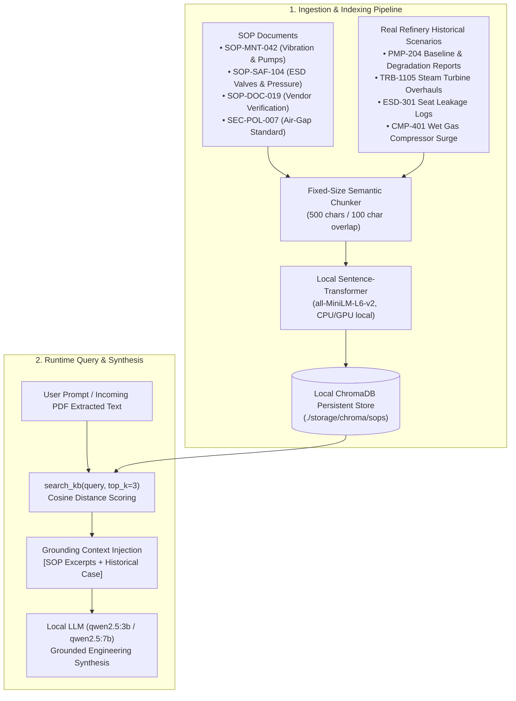

# SOP Integration, RAG Architecture & Master Decision Matrix for PDF Inspections

**Document Classification:** Technical Engineering Reference & Operational Decision Guide  
**Facility Target:** Mangalore Refinery and Petrochemicals Limited (MRPL On-Premises Complex)  
**Location in Repository:** `demo/SOP_RAG_ARCHITECTURE_AND_DECISION_VALUES_GUIDE.md`  
**Applicable Standards:** ISO 10816-3, MRPL SOP-MNT-042, MRPL SOP-SAF-104, SEC-POL-007, API 610/670  

---

## Executive Summary

When industrial inspection reports (PDFs) arrive from field technicians, the Sovereign Workbench executes a dual neuro-symbolic workflow:
1. **Semantic Contextual Retrieval (RAG):** Locates the authoritative Standard Operating Procedure (SOP), statutory regulations, and past maintenance incident scenarios applicable to that specific equipment tag and failure mode.
2. **Authoritative Decision Engine (Rule Engine & Physics):** Extracts mechanical parameters from the PDF and evaluates them against strict deterministic thresholds (ISO 10816-3, OISD, ASME).

This guide provides:
- **Part 1:** How SOPs and real refinery scenarios are ingested, indexed, and retrieved in RAG.
- **Part 2:** The complete, air-gapped architecture of the Sovereign RAG engine.
- **Part 3:** The **Master Decision Matrix**—the exact physical values, formulas, and threshold boundaries required to evaluate any incoming PDF.

---

## Part 1: How SOPs and Real Refinery Scenarios are Added to RAG

In an oil refinery, maintenance and safety guidelines are codified in Standard Operating Procedures (SOPs) and historical incident ledgers. The Sovereign Workbench ingests these documents into a local, vector-indexed Knowledge Base without external cloud dependencies.



### 1.1 The Seed SOP Catalog
The Knowledge Base is initialized with operational standards located in [`backend/scripts/seed_kb.py`](file:///c:/sih117/prototype/backend/scripts/seed_kb.py):

| Document ID | SOP Title | Department | Primary Mandates Governed |
| :--- | :--- | :--- | :--- |
| `sop-mnt-042` | Routine Pump & Turbine Vibration Inspection | Industrial Maintenance | Vibration Zone A/B/C/D limits, bearing temp limits (<80°C), mandatory approval note parameters. |
| `sop-saf-104` | Emergency Isolation for High-Pressure Actuated Valves | Process Safety | Line pressure trip (>150 bar), toxic gas limit (>25 ppm), ESD closure time ($\le 2.5\text{s}$). |
| `sop-doc-019` | Vendor Technical Document Handling & Archival | QA & Procurement | 24-hour ingestion requirement, cryptographic SHA-256 verification of third-party PDF manuals. |
| `sec-pol-007` | Air-Gapped Sovereign AI Data Compliance Standard | Cyber Resilience | 100% on-premises execution, zero WAN egress, mandatory relational audit logging. |

### 1.2 Adding Real Refinery Incident Scenarios
Real scenarios from plant operations (such as the 105 scenarios in [`backend/benchmarks/refinery_scenarios_v1.jsonl`](file:///c:/sih117/prototype/backend/benchmarks/refinery_scenarios_v1.jsonl)) are ingested as historical incident memory:

1. **Equipment Baseline Records:** Initial commissioning benchmarks (e.g., *PMP-204 Baseline: $2.10\text{ mm/s}$ on 2026-08-15*).
2. **Degradation Milestones:** Intermediate inspection sheets capturing mechanical wear progression (e.g., *PMP-204 Stage 2: $5.40\text{ mm/s}$ with minor bearing squeal on 2026-09-05*).
3. **Turnaround & Root Cause Records:** Post-overhaul maintenance summaries documenting replaced impellers, re-aligned shafts, or dynamic balancing certifications.

When an engineer uploads a new PDF for `PMP-204`, RAG retrieves both the governing procedure (`SOP-MNT-042`) and the past historical baseline for `PMP-204`, allowing the agent to evaluate the current reading against both absolute statutory limits and historical growth rates.

---

## Part 2: The Architecture of Sovereign RAG

The Sovereign RAG system is engineered for **100% offline, air-gapped industrial execution**. It uses zero cloud APIs, transmits zero telemetry, and stores embeddings in a local vector database.

```
┌─────────────────────────────────────────────────────────────────────────┐
│                      SOVEREIGN AIR-GAPPED RAG ENGINE                    │
├─────────────────────────────────────────────────────────────────────────┤
│                                                                         │
│  [ INCOMING PDF / PROMPT ]                                              │
│          │                                                              │
│          ▼                                                              │
│  [ Local Embedding Function ]                                           │
│    • Model: sentence-transformers/all-MiniLM-L6-v2                      │
│    • Dimension: 384-d dense vector                                      │
│    • Flags: HF_HUB_OFFLINE=1, TRANSFORMERS_OFFLINE=1                    │
│          │                                                              │
│          ▼                                                              │
│  [ Local ChromaDB Vector Store ]                                        │
│    • Client: chromadb.PersistentClient(path="./storage/chroma")         │
│    • Telemetry: anonymized_telemetry=False (Hard disabled)              │
│    • Collection: "sops"                                                 │
│    • Index: HNSW (Hierarchical Navigable Small World)                   │
│          │                                                              │
│          ▼                                                              │
│  [ Retrieval & Filtering ]                                              │
│    • Metric: Cosine Distance (1 - Cosine Similarity)                    │
│    • Top-K: top_k = 3 most relevant chunks                             │
│    • Metadata Payload: {source, doc_id, chunk_index, equipment_tag}     │
│          │                                                              │
│          ▼                                                              │
│  [ Prompt Context Fusion ]                                              │
│    • System Prompt injects verified chunks under "RELEVANT SOP CONTEXT" │
│    • Model receives exact clause text with original citations           │
│                                                                         │
└─────────────────────────────────────────────────────────────────────────┘
```

### 2.1 Component-by-Component Architectural Breakdown

#### 1. Ingestion Engine ([`backend/app/rag/ingest.py`](file:///c:/sih117/prototype/backend/app/rag/ingest.py))
- **Chunking Algorithm:** Semantic sliding-window chunking.
  ```python
  def chunk_text(text: str, chunk_size: int = 500, overlap: int = 100) -> List[str]
  ```
  - `chunk_size = 500` characters: Sized specifically to keep individual SOP clauses and table rows intact without truncation.
  - `overlap = 100` characters: Preserves contextual continuity across paragraph boundaries.
- **Deterministic ID Generation:** Each chunk is assigned an immutable composite ID: `f"{doc_id}_{chunk_index}"` (e.g., `sop-mnt-042_0`, `sop-mnt-042_1`).

#### 2. Local Embedding Engine ([`backend/app/rag/client.py`](file:///c:/sih117/prototype/backend/app/rag/client.py))
- **Model:** `sentence-transformers/all-MiniLM-L6-v2`.
- **Latency:** $\approx 8 - 15\text{ ms}$ on CPU, $<3\text{ ms}$ on CUDA.
- **Air-Gap Defense:**
  ```python
  os.environ["HF_HUB_OFFLINE"] = "1"
  os.environ["TRANSFORMERS_OFFLINE"] = "1"
  os.environ["ANONYMIZED_TELEMETRY"] = "False"
  ```
  Guarantees that PyTorch and Hugging Face never attempt to contact external model hubs or send telemetry packets over the network.

#### 3. Vector Storage & Persistence ([`backend/app/rag/client.py:L21-L28`](file:///c:/sih117/prototype/backend/app/rag/client.py#L21-L28))
- **Storage Backend:** Local disk storage at `./storage/chroma`.
- **Database Engine:** Embedded SQLite metadata catalog + HNSW vector index files.
- **Persistent Client:** Reuses a single persistent client instance across threads to prevent file lock contention.

#### 4. Retrieval & Distance Scoring ([`backend/app/rag/retrieve.py`](file:///c:/sih117/prototype/backend/app/rag/retrieve.py))
- **Interface:** `search_kb(query: str, top_k: int = 3) -> List[Dict[str, Any]]`.
- **Distance Metric:** Squared L2 / Cosine distance.
- **Returned Metadata:** Each match returns the chunk text, source SOP title, document ID, chunk index, and mathematical relevance distance.

---

## Part 3: Master Decision Matrix: Values Needed to Evaluate Any Incoming PDF

When an engineer or the Sovereign AI processes **any new PDF inspection report**, the following parameters and values must be extracted and evaluated to reach an authoritative, safety-compliant decision.

```
┌────────────────────────────────────────────────────────────────────────┐
│               INCOMING PDF INSPECTION DECISION PIPELINE                │
├────────────────────────────────────────────────────────────────────────┤
│                                                                        │
│  [ STEP 1: ASSET METADATA ]                                            │
│    • Equipment ID: (e.g., PMP-204, TRB-1105)                           │
│    • Machine Class: Group 1 (>300kW) or Group 2 (15kW - 300kW)         │
│    • Foundation Support: Rigid (Bolted Concrete) or Flexible           │
│                                                                        │
│  [ STEP 2: PHYSICAL TELEMETRY EXTRACTION ]                             │
│    • Vibration Velocity RMS (mm/s)                                     │
│    • Bearing / Seal Temperature (°C)                                   │
│    • Operating / Line Pressure (bar)                                   │
│    • Actuation Closure Time (s) [Valves Only]                          │
│                                                                        │
│  [ STEP 3: MATHEMATICAL CALCULATIONS ]                                 │
│    • Proximity Delta: Delta % = ((Actual - Limit) / Limit) * 100       │
│    • Baseline Degradation: Surge % = ((Current - Base) / Base) * 100   │
│    • Exponential Wear Rate: lambda = ln(V_current / V_base) / dt       │
│    • Remaining Useful Life: RUL = ln(7.1 / V_current) / lambda         │
│                                                                        │
│  [ STEP 4: MANDATORY VERDICT & ACTION ASSIGNMENT ]                     │
│    • Zone A (Compliant) -> Routine Monitoring                          │
│    • Zone B (Alert / Review) -> Re-measure in 48h / Spectral Analysis  │
│    • Zone C (Unsatisfactory) -> Work Order within 72h / Lubrication    │
│    • Zone D (Danger / Unacceptable) -> IMMEDIATE EMERGENCY TRIP       │
│                                                                        │
└────────────────────────────────────────────────────────────────────────┘
```

---

### 3.1 Primary Parameter Thresholds (ISO 10816-3 & MRPL Standards)

#### Table 1: Vibration Velocity RMS ($V_{\text{rms}}$ in mm/s) Threshold Matrix

| Machine Classification | Foundation Type | Zone A (Normal / Compliant) | Zone B (Acceptable / Alert) | Zone C (Unsatisfactory / Action) | Zone D (Danger / Emergency Trip) |
| :--- | :--- | :--- | :--- | :--- | :--- |
| **Group 1: Large Machines**<br>(Pumps/Turbines $> 300\text{ kW}$) | **Rigid Foundation**<br>(Concrete grouted base) | $V_{\text{rms}} \le 2.30$ | $2.30 < V \le 4.50$ | $4.50 < V \le 7.10$ | $V_{\text{rms}} > 7.10$ |
| **Group 1: Large Machines**<br>(Pumps/Turbines $> 300\text{ kW}$) | **Flexible Foundation**<br>(Steel structure / isolators) | $V_{\text{rms}} \le 3.50$ | $3.50 < V \le 7.10$ | $7.10 < V \le 11.00$ | $V_{\text{rms}} > 11.00$ |
| **Group 2: Medium Machines**<br>(Pumps $15\text{ kW} - 300\text{ kW}$) | **Rigid Foundation**<br>(*Standard refinery pumps*) | $V_{\text{rms}} \le 1.40$ | $1.40 < V \le 2.80$ | $2.80 < V \le 4.50$ | $V_{\text{rms}} > 4.50$ |
| **Group 2: Medium Machines**<br>(Pumps $15\text{ kW} - 300\text{ kW}$) | **Flexible Foundation** | $V_{\text{rms}} \le 2.30$ | $2.30 < V \le 3.50$ | $3.50 < V \le 7.10$ | $V_{\text{rms}} > 7.10$ |

*Note: In MRPL SOP-MNT-042, default refinery centrifugal pumps on standard skid foundations are evaluated under **Group 1/2 Rigid limits**, where $\le 2.80\text{ mm/s}$ is Zone A/B, $4.50\text{ mm/s}$ marks the Zone B/C boundary, and $7.10\text{ mm/s}$ is the trip limit.*

---

#### Table 2: Auxiliary Mechanical & Process Parameters

| Physical Parameter | Engineering Unit | Normal Operating Range | Alert Threshold (Zone B) | Max Allowable Limit (Zone C/D) | SOP / Standard Reference | Action Upon Violation |
| :--- | :--- | :--- | :--- | :--- | :--- | :--- |
| **Bearing Temperature** | ${}^\circ\text{C}$ | $40.0 - 65.0$ | $> 70.0$ | **$80.0\ {}^\circ\text{C}$** | SOP-MNT-042 | Check lube oil level, flush oil filter, reduce pump throughput. |
| **Mechanical Seal Temp** | ${}^\circ\text{C}$ | $45.0 - 70.0$ | $> 75.0$ | **$85.0\ {}^\circ\text{C}$** | API 682 | Inspect seal flush plan (Plan 11/52), check for face vaporizing. |
| **Operating Line Pressure** | $\text{bar}$ | $40.0 - 120.0$ | $> 135.0$ | **$150.0\ \text{bar}$** | SOP-SAF-104 | Open bypass relief, throttle suction valve, notify unit supervisor. |
| **Differential Pressure Drop** | $\%$ | $< 15.0\%$ | $> 25.0\%$ | **$> 40.0\%$** | SOP-SAF-104 | Valve seat leakage suspected; schedule inline acoustic leak check. |
| **ESD Actuation Closure Time** | $\text{seconds}$ | $0.5 - 1.8$ | $> 2.0$ | **$\le 2.5\ \text{s}$** | SOP-SAF-104 | Lubricate actuator rack, inspect pneumatic air supply pressure. |
| **Downstream Zero Flow Time** | $\text{seconds}$ | $1.0 - 3.0$ | $> 4.0$ | **$\le 5.0\ \text{s}$** | SOP-SAF-104 | Emergency valve fail-to-isolate alarm. Initiate manual block valve. |
| **Toxic Gas Concentration (H2S)**| $\text{ppm}$ | $0.0 - 5.0$ | $> 10.0$ | **$25.0\ \text{ppm}$** | OISD-118 / SOP-SAF-104 | Immediate area evacuation, activate deluge water curtain, trip plant. |

---

### 3.2 Key Decision Formulas to Apply to Incoming PDF Data

When evaluating extracted values from a PDF, apply these four exact mathematical calculations:

#### 1. Proximity Delta Percentage ($\Delta\%$)
Measures how close an asset is to exceeding its operational limit:
$$\Delta\% = \left(\frac{V_{\text{actual}} - V_{\text{limit}}}{V_{\text{limit}}}\right) \times 100$$
- **Rule:** If $0\% < \Delta\% \le 10\%$, activate the **Self-Consistency Ensemble Gate** to verify stability before issuing a violation alert.
- **Example:** $V_{\text{actual}} = 4.60\text{ mm/s}$, Limit $= 4.50\text{ mm/s}$:
  $$\Delta\% = \left(\frac{4.60 - 4.50}{4.50}\right) \times 100 = +2.22\% \quad (\text{Borderline Non-Compliant})$$

#### 2. Baseline Growth Surge Percentage ($\% \text{Increase}$)
Measures rate of degradation relative to the machine's healthy baseline:
$$\% \text{Increase} = \left(\frac{V_{\text{current}} - V_{\text{baseline}}}{V_{\text{baseline}}}\right) \times 100$$
- **Surge Classification:**
  - $< +25\%$: Normal wear / Stable baseline.
  - $+25\% \text{ to } +50\%$: Moderate degradation (Monitor trend).
  - $+50\% \text{ to } +100\%$: Rapid degradation (Schedule inspection within 7 days).
  - $> +100\%$: Severe mechanical surge (Immediate inspection within 24–48 hours).
- **Example:** Baseline $= 2.10\text{ mm/s}$, Current $= 5.40\text{ mm/s}$:
  $$\% \text{Increase} = \left(\frac{5.40 - 2.10}{2.10}\right) \times 100 = +157.14\% \quad (\text{Critical Surge})$$

#### 3. Exponential Degradation Constant ($\lambda$)
Captures accelerating wear dynamics:
$$\lambda = \frac{\ln\left(V_{\text{current}} / V_{\text{baseline}}\right)}{\Delta t_{\text{days}}}$$
- **Example:** $V_{\text{base}} = 2.10\text{ mm/s}$ at $t=0$, $V_{\text{curr}} = 5.40\text{ mm/s}$ at $t=21\text{ days}$:
  $$\lambda = \frac{\ln(5.40 / 2.10)}{21} = \frac{0.9445}{21} = 0.0450\ \text{days}^{-1}$$

#### 4. Remaining Useful Life (RUL to Zone D Limit)
Projects days remaining until vibration reaches the catastrophic trip limit ($V_{\text{crit}} = 7.10\text{ mm/s}$):
$$t_{\text{crit}} = \frac{\ln\left(V_{\text{crit}} / V_{\text{baseline}}\right)}{\lambda}$$
$$\text{RUL (days)} = t_{\text{crit}} - t_{\text{current}}$$
- **Example Calculation:**
  $$t_{\text{crit}} = \frac{\ln(7.10 / 2.10)}{0.0450} = \frac{1.218}{0.0450} = 27.07\ \text{days}$$
  $$\text{RUL} = 27.07 - 21.00 = 6.07\ \text{days} \quad (\approx \mathbf{6.1\ \text{days}})$$

---

### 3.3 Decision Tree: Mandatory Actions Assigned by Verdict

```
                     Extracted Reading from PDF
                                 │
                                 ▼
                     Vibration RMS & Bearing Temp
                                 │
         ┌───────────────────────┼───────────────────────┐
         │                       │                       │
         ▼                       ▼                       ▼
    [ ZONE A ]              [ ZONE B ]              [ ZONE C / D ]
  V <= 2.8 mm/s         2.8 < V <= 4.5 mm/s          V > 4.5 mm/s
   Temp <= 65°C           65 < Temp <= 80°C           Temp > 80°C
         │                       │                       │
         ▼                       ▼                       ▼
   COMPLIANT               NEEDS_REVIEW            NON_COMPLIANT
  (PASS - Level 1)        (PASS - Alert)          (FAIL - Action)
         │                       │                       │
  Routine Interval;     Schedule Spectral       Zone C: Overhaul WO
  Immediate Sign-Off.   Analysis in 14d;        within 72 hours.
                        Re-measure in 48h.      Zone D: IMMEDIATE TRIP.
```

---

## Summary Checklist for Processing a New PDF

When reviewing any incoming PDF, verify this 6-point checklist:

- [ ] **1. Equipment ID Identified:** Equipment tag parsed and matched against plant hierarchy (e.g., `PMP-204` $\rightarrow$ `CDU-1` Booster Pump).
- [ ] **2. Foundation & Power Class Verified:** Classified into Group 1 or Group 2, Rigid or Flexible.
- [ ] **3. Numeric Cleanliness:** All values stripped of injection strings and verified within plausible physical ranges ($0–100\text{ mm/s}$, $-20–250^\circ\text{C}$).
- [ ] **4. ISO 10816-3 Zone Stamped:** Authoritative zone determined deterministically by rule engine, NOT by LLM estimation.
- [ ] **5. Delta & Baseline Computed:** Proximity $\Delta\%$ and Baseline Growth $\%$ calculated with exact two-decimal precision.
- [ ] **6. SOP Citation Grounded:** Document explicitly cites governing SOP clause (e.g., `SOP-MNT-042 Section 2`) retrieved via air-gapped RAG.
